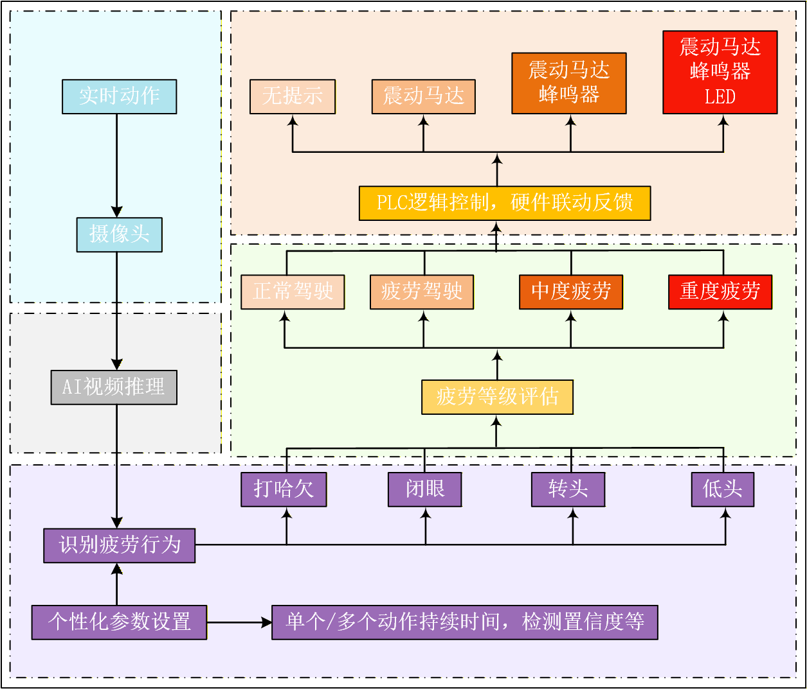

# Muse Pi Pro Driver Behavior Detection System

**An Engineering Prototype of an Embedded Vision and PLC Control System
Based on the SpaceMIT RISC-V Platform**

[Original Repository on Gitee](https://gitee.com/achenjiayi/MusePiPro_Driving_Detecte) | [GitHub Mirror](#)

---

## Project Overview

This project is a **vision-driven PLC control system** designed for industrial and automotive scenarios. It runs on the Muse Pi Pro development board (SpaceMIT K1 / Bianbu Linux), which is based on the RISC-V architecture.

The system captures video streams from a camera and performs real-time object detection and driver behavior analysis (DMS) using a YOLOv8 model accelerated by the onboard NPU. Detection results are transmitted to a software PLC Runtime via Modbus TCP, which then drives isolated GPIOs and relays to achieve reliable and deterministic hardware control.

**Core design objectives**: stability, decoupling, and engineering reproducibility.
The system adopts a clear separation between *vision perception* and *safety execution*. All non-essential modules (e.g., 4G/GPS) are optional and configurable, ensuring stable operation even in a minimal system configuration.

---

## System Architecture

The system adopts a **single-process + multi-threaded backend model**, where the PLC Runtime runs as an independent process and is centrally managed by a Supervisor to ensure high availability.

### 1. Process and Module Breakdown

* **Supervisor**
  Responsible for process startup, status monitoring, and automatic recovery. If the PLC Runtime crashes, the Supervisor will attempt to restart it automatically.

* **Vision Backend (YOLO + Behavior Analysis)**
  Handles camera input, NPU inference, and behavior classification. Periodically writes heartbeat signals to the PLC.

* **PLC Runtime (Independent Process)**
  Executes ladder logic, maintains a Modbus TCP server (Port 502), and handles GPIO mapping and output control.

### 2. Data Flow

`Camera → YOLO (NPU) → Behavior Analysis → PLC Runtime (Modbus) → GPIO → Relay → External Device`

### 3. Heartbeat and Fail-Safe Mechanism

The system implements strict heartbeat monitoring and fault-handling logic:

* **YOLO crash or freeze**
  The PLC detects missing heartbeats, immediately disables all outputs, and switches the status indicator to a fast-blinking error mode.

* **PLC crash**
  The Supervisor captures the failure and automatically attempts to restart the PLC Runtime. Hardware outputs are reset during recovery.

* **Power-off protection**
  In the event of unexpected power loss, all outputs are mechanically pulled low to prevent unintended actuator activation.

---

## Key Features

* **RISC-V + NPU Acceleration**
  Powered by the SpaceMIT K1 NPU, running quantized ONNX models via `SpaceMITExecutionProvider`, significantly reducing CPU load.

* **Industrial-Grade Control Logic**
  AI algorithms and PLC logic are fully decoupled: AI is responsible for “perception,” while the PLC is responsible for “control.”

* **Standardized Interfaces**
  Exposes a standard Modbus TCP interface, supports multiple concurrent clients, and integrates easily with upper-level systems.

* **Multi-Modal Feedback**
  Supports various hardware feedback mechanisms, including vibration motors, LEDs, and buzzers.

* **Extensibility**
  Supports EC800M (4G/GPS) expansion modules, with breakpoint resume and local buffering capabilities.

---

## Privacy and Data Security

This project follows the principle of **Privacy by Design**. By default, it **does not collect, store, or upload** any user personal data.

### 1. Data Processing Policy

* **Fully Local Execution**
  All core detection and control logic runs locally on the NPU and does not require network connectivity.

* **No Cloud Dependency**
  The project does not include any mandatory cloud services and does not provide map API keys.

### 2. Optional Data Upload (Manually Enabled)

Only when the 4G/GPS expansion module is enabled and a server address is explicitly configured will the system upload anonymized data, including:

* Behavior event types (e.g., “eyes closed,” “yawning”)
* GPS coordinates and timestamps at the time of the event

*Note: Image and video streams are not uploaded by default. They can only be viewed over a local network in debugging mode.*

---

## Hardware Support

* **Main Platform**: Muse Pi Pro (SpaceMIT K1)
* **Operating System**: Bianbu Linux
* **Vision Input**: USB camera (V4L2, default `/dev/video20`)
* **Actuators**:
  Use MOSFETs or other isolated driver boards. **Do not drive high-current loads directly from GPIO pins.**

---

## Installation and Deployment

This project includes complete hardware wiring diagrams, system environment configuration, and software deployment procedures.

For detailed step-by-step deployment instructions, refer to:
**[./三端部署说明.md](./三端部署说明.md)**

*(This document includes hardware connection diagrams, NPU driver verification, dependency installation, and service auto-start configuration.)*

For Modbus default resource definitions, refer to:
**[./plc_cpp/Modbus资源展示.md](./plc_cpp/Modbus资源展示.md)**

For details on the standalone PLC process, refer to:
**[./plc_cpp/README.md](./plc_cpp/README.md)**

---

## License

This project is licensed under **MIT**.

It is intended **for engineering research and prototype validation only**.

